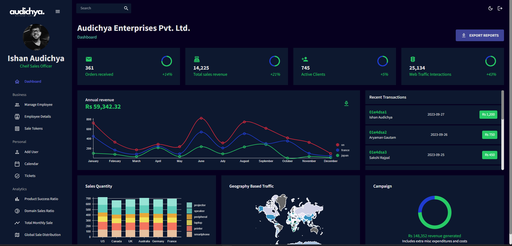
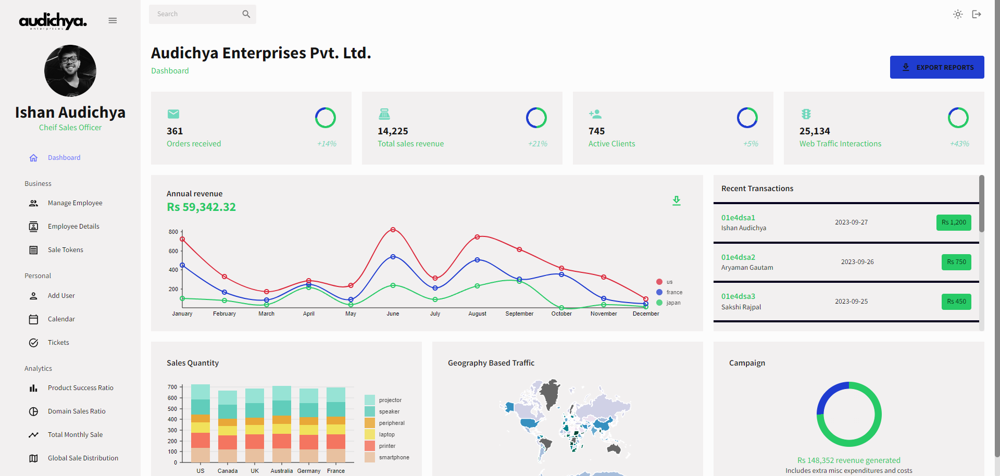

# Company Sales Management Software

## Table of Contents

- [Introduction](#introduction)
- [Features](#features)
- [Installation](#installation)
- [Usage](#usage)
- [Contributing](#contributing)
- [License](#license)

## Introduction

Welcome to our Company Sales Management Software! This React.js-based application is designed to streamline your company's sales processes, analytics, and more. It offers a user-friendly interface for managing sales data, employee information, access control, and task assignments efficiently.

## Features

### Authentication and Security

- **Secure Login and Logout:** Users can securely log in and out using password-based authentication.

- **Session Management:** The application ensures that users remain logged in even after refreshing the page, enhancing the user experience.

### Sales Analytics and Reviews

- **Sales Analytics:** Gain insights into various sales metrics and analytics from around the world.

- **Reviews:** Monitor and manage customer reviews and feedback effectively.

### Employee Management

- **Employee Information:** Store and manage comprehensive employee information, including contact details.

- **Access Control:** Admin and authorized employees have privileges to manage access control.

### Data Export

- **Export to CSV:** Easily export data to CSV format for further analysis and reporting.

### Daily Transaction Tracking

- **Daily Transactions:** Keep track of daily sales transactions and related activities.

### Geographic Sales Data

- **Geographic Map:** Visualize sales data on a geographical map, showing sales statistics for each country.

### Task Management

- **On-Spot Ticket Generation:** Generate and assign tasks to employees in real-time, ensuring efficient task management.

### Company Calendar

- **Event Management:** Manage company events, meetings, and important dates with a feature-rich calendar.
### Light And Dark Mode

- **Light and Dark Mode Compatible** The UI is built on both dark and light mode .

## Installation

To run this software locally, follow these steps:

1. Clone the repository: `git clone https://github.com/ishanaudichya/company-sales-management.git`

2. Navigate to the project directory: `cd company-sales-management`

3. Install dependencies: `npm install`

4. Start the development server: `npm start`

5. Open your browser and access the application at `http://localhost:3000`

## Usage

1. Login to the application with your credentials.

2. Explore the various features, including sales analytics, employee management, task assignment, and more.

3. Export data to CSV for further analysis.

4. Utilize the company calendar to manage events and meetings.

## Contributing

We welcome contributions from the community to enhance this project. If you'd like to contribute, please follow these guidelines:

1. Fork the repository.

2. Create a new branch for your feature or bug fix: `git checkout -b feature/new-feature`

3. Make your changes and commit them: `git commit -m "Add new feature"`

4. Push to your forked repository: `git push origin feature/new-feature`

5. Create a pull request to the main repository.

6. Be sure to follow our [Code of Conduct](CODE_OF_CONDUCT.md).

## License

This project is licensed under the [MIT License](LICENSE.md).
